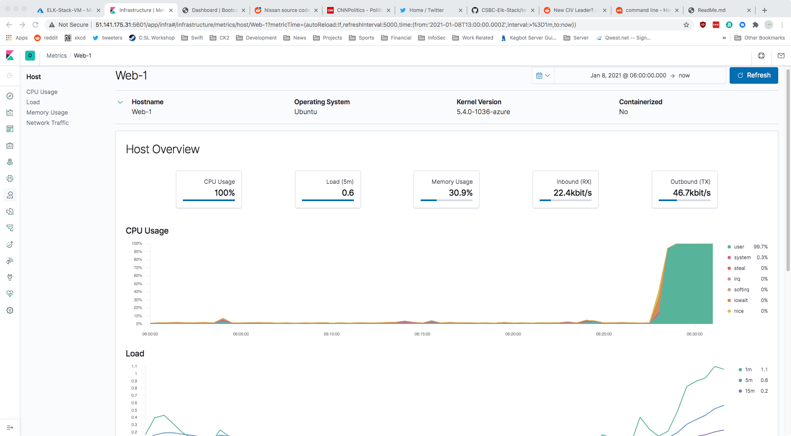

# Kibana Continued

### Setup

The Web VMs have the following IP addresses:

* Web-1 - `10.1.0.5`
* Web-2 - `10.1.0.6`
* Web-3 - `10.1.0.9`

---

### SSH Barrage

To verify that Kibana is picking up failed login attempts, we generate a high
number of failed SSH login attempts using the JumpBox VM, which does not have
proper SSH permissions to access any of the Web VMs.

The script located [here](./scripts/ssh-barrage.sh) can be used from the JumpBox to generate an arbitrary number of failed SSH login attempts on any or all of
the Web VMs.

To use the script, simply download it to the JumpBox (available at [this
url](https://raw.githubusercontent.com/baberthal/CSBC-Elk-Stack/prime/Kibana-Continued/scripts/ssh-barrage.sh)),
ensure it is executable, and run it.

#### Script Installation

```bash
# Assuming you are logged into the JumpBox VM
sysadmin@JumpBox:~$ curl -O https://raw.githubusercontent.com/baberthal/CSBC-Elk-Stack/prime/Kibana-Continued/scripts/ssh-barrage.sh
sysadmin@JumpBox:~$ chmod +x ./ssh-barrage.sh
```

#### Script Usage

Set the environment variable `$DEBUG` to a non-empty value to enable debugging
messages. Be aware that the debug logging is very verbose, and will print a
message with the attempt number and ip address of the target host each time a
login is attempted.

Set the environment variable `$DRY_RUN` to a non-empty value to simply print the
commands that would be run, without actually doing any work.

Any additional arguments to the script will be treated as the desired host on
which to attempt logins, overriding the default hosts.

##### Examples

Attempt to login to each machine the default number of times (default behaviour):

```bash
sysadmin@JumpBox:~$ ./ssh-barrage.sh
```

Attempt to login to each machine 200 times:

```bash
sysadmin@JumpBox:~$ NUM_LOGIN_ATTEMPTS=200 ./ssh-barrage.sh
```

Attempt to login to a custom host (specified by any additional arguments to the script):

```bash
sysadmin@JumpBox:~$ ./ssh-barrage.sh 10.0.0.5
```

Attempt to login to many custom hosts:

```bash
sysadmin@JumpBox:~$ ./ssh-barrage.sh 10.0.0.5 10.0.0.6
```

Don't actually do anything, but see what would be run:

```bash
sysadmin@JumpBox:~$ DRY_RUN=1 ./ssh-barrage.sh
```

---

### Linux Stress

To verify that Kibana is picking up excessive CPU usage in the metrics page,
we will use the Linux program `stress` to artifically stress the CPU of one of
the Web VMs.

To perform this test, first we must SSH into the Web VM via the JumpBox and
Ansible container:

```bash
# Assuming you have SSHed into the JumpBox, and attached the Ansible docker
# container
root@ed622b84bcd3:~# ssh sysadmin@10.1.0.5
```

Ensure the `stress` program is installed:

```bash
# Now we are in the Web-1 VM
sysadmin@Web-1:~$ sudo apt update
sysadmin@Web-1:~$ sudo apt install stress
```

Run `stress` for a few minutes, and monitor the Kibana metrics page:

```bash
# Press Ctrl-C after a few minutes to stop
sysadmin@Web-1:~$ sudo stress --cpu 1
```

Repeat these steps with all three of the Web VMs. The results should look like
this:



---

### wget-DoS

To verify the ELK server is working as expected, we will generate a large number
of web requests to the pen-testing servers, and confirm that Kibana is picking
up both the logs and metrics.

#### Generating a Single Request

To generate a sigle request on a given Web VM with the IP address `10.1.0.5`,
run the following command (assuming you are logged into the JumpBox):

```bash
sysadmin@JumpBox:~$ wget 10.1.0.5
```

This will create the file `index.html` in the current directory.

#### Generating Multiple Requests on a Single Machine

To generate a series of requests (for example 10,000) on a given Web VM with the
IP address `10.1.0.5`, run the following command
(assuming you are logged into the JumpBox):

```bash
sysadmin@JumpBox:~$ for (( i = 0; i < 10000; i++ )); do
> wget 10.1.0.5
> done
```

This will create the files `index.html` for each request, resulting in 100
`index.html` files in the current directory, each suffixed with the number of
the request.

To remove all the generated files with one command, run:

```bash
sysadmin@JumpBox:~$ rm index.html*
```


To issue the requests without generating the extraneous `index.html` files, one
can run the following `wget` command:

```bash
sysadmin@JumpBox:~$ for (( i = 0; i < 10000; i++ )); do
> wget -O /dev/null -o /dev/null 10.1.0.5
> done
```

The `-O` option sends the downloaded file to `/dev/null`, and the `-o` option
outputs `wget`'s logs to `/dev/null`, rather than `stderr`.


If one prefers the more fully-featured `curl` program, the same can be achieved
by running:

```bash
sysadmin@JumpBox:~$ for (( i = 0; i < 10000; i++ )); do
> curl -L -s 10.1.0.5 > /dev/null
> done
```

The `-L` flag tells `curl` to follow redirects, and the `-s` flag puts `curl` in
"silent" or "quiet" mode, and doesn't show a progress bar.


To issue requests to all three of the web VMs, (given that they have the IP
addresses 10.1.0.5, 10.1.0.6, and 10.1.0.9), one can run the following
command:

```bash
sysadmin@JumpBox:~$ for ip in 10.1.0.5 10.1.0.6 10.1.0.9; do
> for (( i = 0; i < 10000; i++ )); do
>   curl -L -s "${ip}" > /dev/null
> done
> done
```


##### Results Analysis

After running the above command and monitoring the Kibana metrics page, the
following VM metrics were affected:

* **CPU Usage:**
  - CPU usage spiked to about 24% at the beginning of the request sequence, but
    then leveled off at around 10-12%. This indicates machine's CPU was
    minimally stressed but was not significantly affected.

* **CPU Load:**
  - CPU load (i.e. the number of processes being executed or waiting to be
    executed by the CPU) never rose above 0.5 in a one minute period.

  - This indicates that the CPU did not have trouble fulfilling all the requests
    it received. This is likely due to the fact the requests were issued
    synchronously. If each request process was forked so it ran concurrently,
    CPU load may have been adversely affected, although the relatively slow
    speed of network I/O could still have caused the CPU load to remain low.

* **Memory Usage:**
  - The machine's memory usage consistently at 32.5%, and did not change at all
    during the request sequence.

* **Inbound (RX):**
  - This metric indicates the bit rate of incoming traffic to the machine while
    the request sequence was being issued, and was far and away the most
    affected metric.

  - Inbound traffic spiked to about 4.4 Mbit/sec (megabits per second) in the
    beginning of the request but gradually tailed off, leveling out at about
    1.1 Mbit/sec.

  - Each HTTP GET request (what `wget` issues) must be received by the machine
    before it is processed, so issuing 10,000 requests naturally increased the
    bit rate of incoming traffic.

* **Outbound (TX):**
  - This metric indicates the bit rate of outgoing traffic from the machine to
    the client.

  - Outbound traffic followed in-line with incoming traffic, but was slightly
    slower. The outbound bit rate spiked to approximately 3.2 Mbit/sec, and
    gradually tailed off, leveling out at about 850 kbit/sec.
