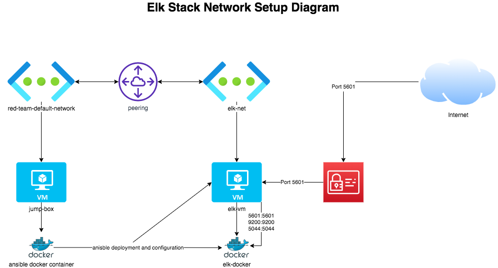

# CSBC-Elk-Stack

Elk Stack Project for CSBC

## Network Setup Overview

The following is a diagram of the network setup for the elk stack:



## Ansible Directory Structure

The following directory structure is used to store anisble configurations:

```bash
/etc/ansible/     # Main ansible configuration directory
    ansible.cfg   # Main ansible configuration file
    hosts         # Ansible hosts configuration
    roles/        # Directory to store ansible roles
        files/    # Directory to store ansible playbooks for the Elk server
```
