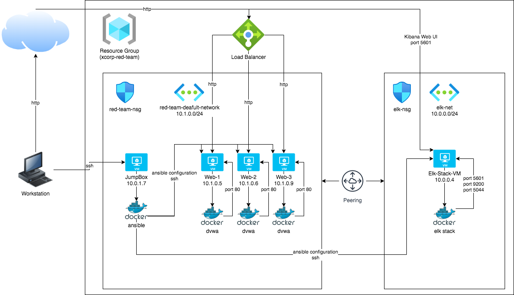
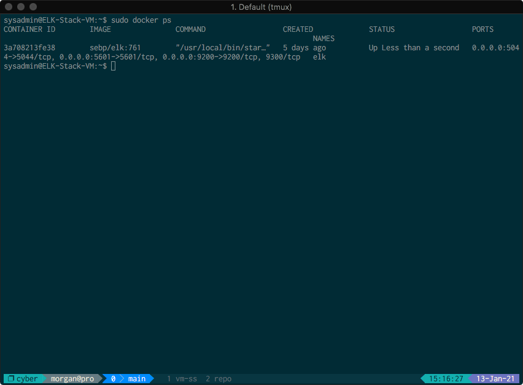

# CSBC-Elk-Stack

Elk Stack Project for CSBC.

## Automated ELK Stack Deployment

The files in this repository were used to configure the network depicted in the
diagram below.



These files have been tested and used to generate a live ELK deployment on
Azure. They can be used to recreate the entire deployment pictured above.
Alternatively, select portions of the following Ansible playbook files can be
used to install only certain portions of it, such as Filebeat.

  * [Elk Installation Playbook](./ansible/roles/install-elk.yml) to install and
    configure the ELK server.
  * [Filebeat Playbook](./ansible/roles/filebeat-playbook.yml) to install and
    configure Filebeat on the target machines.
  * [Metricbeat Playbook](./ansible/roles/metricbeat-playbook.yml) to install and
    configure Metricbeat on the target machines.

This document contains the following details of the deployment:
* Description of Network Topology
* Access Policies
* ELK Configuration
  * Beats in Use
  * Machines being Monitored
* Usage Instructions for Ansible Build

### Network Topology Description

The main purpose of this network is to expose a load-balanced and monitored
instance of DVWA, the Damn Vulnerable Web Application.

Load balancing ensures that the application will be highly available, in
addition to restricting access to the network. The use of a load-balancer
ensures the machines running DVWA are not directly accessible from the internet,
and protected from unauthorized SSH access from outside the network. The use of
the jump box ensures we can only access the other machines from the docker
container running within.

Integrating an ELK server allows users to easily monitor the vulnerable VMs for
changes to the VM metrics and system logs. The Metricbeat and Filebeat modules
were installed on the DVWA VMs, and monitor the following:
* **Filebeat:** Monitors system logs on the machines.
* **Metricbeat:** Monitors VM metrics, including network I/O, CPU usage, CPU
  load, and memory pressure.

The configuration details of each machine may be found in the table below:

| Name                 | Function    | IP Address | Operating System |
| -------------------- | ----------- | ---------- | ---------------- |
| Jump-Box-Provisioner | Gateway     | 10.1.0.4   | Linux (Ubunutu)  |
| Web-1                | DVWA Server | 10.1.0.5   | Linux (Ubunutu)  |
| Web-2                | DVWA Server | 10.1.0.6   | Linux (Ubunutu)  |
| Web-3                | DVWA Server | 10.1.0.9   | Linux (Ubunutu)  |
| Elk-Stack-VM         | ELK Stack   | 10.0.0.4   | Linux (Ubuntu)   |

### Access Policies

Machines on the internal network are not exposed to the public internet.

Only the Jump-Box-Provisioner machine can accept connections from the internet.
Access to this machine is only allowed from the following IP addresses:

* 184.96.25.XXX (Redacted for security purposes)

Machines within the network can only be accessed by the Jump Box, which has the
IP address `10.1.0.4`.

A summary of access policies in place can be found in the table below:

| Name                 | Publicly Accessible | Allowed IP Addresses |
| -------------------- | ------------------- | -------------------- |
| Jump-Box-Provisioner | Yes                 | 184.96.25.XXX        |
| Web-1                | No                  | 10.1.0.4             |
| Web-2                | No                  | 10.1.0.4             |
| Web-3                | No                  | 10.1.0.4             |
| Elk-Stack-VM         | No                  | 10.1.0.4             |

### Elk Configuration

Ansible was used to automate configuration of the ELK machine. No configuration
was performed manually, which is advantageous because it reduces the chance of
typos and human error when configuring the machine.

Three playbooks in total were used, each implementing the following tasks:

* [Install ELK Playbook](./ansible/roles/install-elk.yml)
  * Install docker.io package using `apt`
  * Install python3-pip package manager using `apt`
  * Install the docker module using `pip`
  * Configure the VM to use more memory using the `sysctl` module
  * Download and launch the docker container for the ELK stack

* [Install Filebeat Playbook](./ansible/roles/filebeat-playbook.yml)
  * Download and install Filebeat
  * Copy Filebeat configuration
  * Enable Filebeat system module
  * Setup Filebeat
  * Start and enable Filebeat service

* [Install Metricbeat Playbook](./ansible/roles/metricbeat-playbook.yml)
  * Download and install Metricbeat
  * Copy Metricbeat configuration
  * Enable Metricbeat docker module
  * Setup Metricbeat
  * Start and enable Metricbeat service

The following screenshot displays the result of running `docker ps` after
successfully configuring the ELK instance.



### Target Machines and Beats

This ELK server is configured to monitor the following machines:
* Web-1
* Web-2
* Web-3

We have installed the following Beats on these machines:
* Filebeat
* Metricbeat

These Beats allow us to collect the following information from each machine:
* `Filebeat` collects system logs, allowing us to view a variety of information,
  including successful and failed login attempts, failed processes, errors that
  occur in running processes, etc.
* `Metricbeat` collects metric information on each system, allowing us to view
  CPU load, network I/O, CPU usage, and memory pressure, among other things.

### Playbook Usage

In order to use the playbooks, you will need to have an Ansible control node
already configured. Assuming you have such a control node provisioned:

SSH into the control node and follow the below steps:

* Copy the three playbook files (`install-elk.yml`, `filebeat-playbook.yml`, and
  `metricbeat-playbook.yml`) to the `/etc/ansible/roles` directory on your
  control node.
* Update the `/etc/ansible/hosts` file. You will need to include a group called
  `elkservers` which contains the IP address of the server you wish to install
  the ELK stack on. Additionally, you will need to create a group called
  `webservers` with the IP addresses of the target machines you wish to monitor.
  An example configuration has been provided below:
  ```ini
  [webservers]
  10.1.0.5 ansible_python_interpreter=/usr/bin/python3
  10.1.0.6 ansible_python_interpreter=/usr/bin/python3
  10.1.0.9 ansible_python_interpreter=/usr/bin/python3

  [elkservers]
  10.0.0.4 ansible_python_interpreter=/usr/bin/python3
  ```
* Run the playbook, and navigate to `http://[PUBLIC IP OF ELK SERVER]:5601` to
  confirm that the installation worked as expected.

Example commands are shown below. Note that the exact commands may differ
based on your exact configuration.

From the Ansible control node:
```bash
# Clone this repository
$ git clone https://github.com/baberthal/CSBC-Elk-Stack

# NOTE: `sudo` may be required for the following commands, depending on your
# exact configuration

# Ensure the destination directories exist
$ mkdir -p /etc/ansible/roles/files

# Copy the playbooks to the expected locations
$ cp CSBC-Elk-Stack/ansible/roles/install-elk.yml /etc/ansible/roles
$ cp CSBC-Elk-Stack/ansible/roles/filebeat-playbook.yml /etc/ansible/roles
$ cp CSBC-Elk-Stack/ansible/roles/metricbeat-playbook.yml /etc/ansible/roles

# Copy the filebeat and metricbeat configurations to the expected location
$ cp CSBC-Elk-Stack/ansible/roles/files/filebeat-config.yml /etc/ansible/roles/files
$ cp CSBC-Elk-Stack/ansible/roles/files/metricbeat-config.yml /etc/ansible/roles/files

# Update the /etc/ansible/hosts file with appropriate configuration
$ vi /etc/ansible/hosts

# Run the ELK installation playbook
$ ansible-playbook /etc/ansible/roles/install-elk.yml

# Run the Filebeat installation playbook
$ ansible-playbook /etc/ansible/roles/filebeat-playbook.yml

# Run the Metricbeat installation playbook
$ ansible-playbook /etc/ansible/roles/metricbeat-playbook.yml
```
